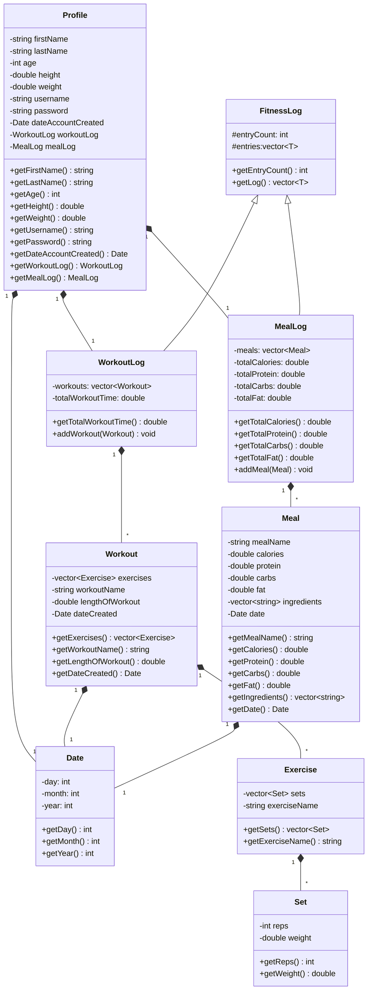

# Workout Tracker API Design Document

## Introduction

This API allows users to create Profiles that store Meal and Workout Logs. This allows users to keep track of their workouts and meals by logging them and being able to view them in the future. Each Meal entry will prompt information about the meal's indegredients, and the amount of calories, protein, carbs, and fat in the the meal. Each workout entry will ask for each exercise performed, and the amount of sets and reps performed for each exercise. Each meal and workout will also correspond to a certain date that must be a valid date.

## Background/Context

While many fitness applications focus exclusively on either workout tracking or nutritional monitoring, fitness enthusiasts need a unified solution that handles both aspects effectively. This API addresses this need by providing a single, cohesive system for managing both workout progression and nutritional data, allowing users to maintain comprehensive records of their fitness journey.

## Stakeholders

- **Fitness Enthusiasts**: Primary users tracking their workouts, nutrition, and progress
- **Personal Trainers**: Professionals creating and monitoring client workout plans and nutrition
- **Nutritionists**: Professionals monitoring client dietary patterns
- **Gym Owners**: Business owners tracking member activities
- **App Developers**: Technical users integrating fitness tracking into applications

## Functional Requirements

1. **Resource Creation**

   - Create new user profiles with personal information.
   - Record complete workout sessions with multiple exercises and track individual exercises with multiple sets.
   - Record individual meals with detailed nutritional information.

2. **Resource Retrieval**

   - Retrieve lists of workouts, and nutrition logs via GET requests
   - Authenticate users for secure access to their data.
   - View profile information in both limited and full detail formats
   - Return 200 OK status code with requested resources

3. **Resource Update**

   - Users should not be allowed to change their meal or workout logs after they are entered.
   - Update profile information.

4. **Data Persistence**
   - Save all resources to file when service stops
   - Load resources from file when service starts

## Use Case Description

### Profile Management

- **Create**: As a user, I want to create a profile to store my fitness information securely
- **Read**: As a user, I want to view my profile details to verify my information
- **Update**: As a user, I want to be able to update profile information as necessary

### Workout Tracking

- **Create**: As a user, I want to log my workouts with specific exercise details, I want to record multiple sets with weight and repetition data.
- **Read**: As a user, I want to view my past workouts to monitor my progress
- **Update**: As a user, I want to add workouts to my workout log.

### Meal Tracking

- **Create**: As a user, I want to log my meals with detailed nutritional information.
- **Read**: As a user, I want to view my past meals and macronutrient intake
- **Update**: As a user, I want to add meals to my meal log

## List Of Resources

- **Profile**: A profile that is signified by a username and password
- **Workout**: A single workout session
- **Exercise**: A specific exercise within a workout
- **Set**: A set of repetitions for an exercise
- **Meal**: A single meal and corresponding nutritional information.
- **WorkoutLog**: A vector of individual workout sessions
- **MealLog**: A vector of logged meals

## List of End Points

### Profile

- **GET** `/workout-api/profile`

  - **Description**: Retrieve the user's profile information.
  - **Parameters**:
    - `username` (string, required): The username of the user whose profile is being retrieved.
    - `password` (string, required): The password for user authentication.
    - `limited-view` (boolean, required): If `true`, returns a limited set of profile information. If `false`, a detailed view is returned.
  - **Response**:
    - 200 OK
    - `limited-view=true`:
      ```
      {
        "username": "janedoe",
        "weight": 105.6,
        "dateAccountCreated": {
            "year": 2024,
            "month": 12,
            "day": 7
        },
        "height": 63.0,
        "age": 23,
        "lastName": "Doe",
        "firstName": "Jane"
      }
      ```
    - `limited-view=false`:
      ```
      {
        "workoutLog": {
            "workoutCount": 2,
            "totalWorkoutTime": 291.0,
            "workouts": [
                {
                    "lengthOfWorkout": 134.55,
                    "dateCreated": {
                        "day": 7,
                        "month": 12,
                        "year": 2024
                    },
                    "exercises": [
                        {
                            "sets": [
                                {
                                    "weight": 225.0,
                                    "reps": 4
                                },
                                {
                                    "reps": 4,
                                    "weight": 215.0
                                },
                                {
                                    "weight": 205.0,
                                    "reps": 3
                                }
                            ],
                            "exerciseName": "Bench press"
                        },
                        {
                            "exerciseName": "Pushdowns",
                            "sets": [
                                {
                                    "reps": 12,
                                    "weight": 90.0
                                },
                                {
                                    "weight": 90.0,
                                    "reps": 12
                                },
                                {
                                    "reps": 12,
                                    "weight": 90.0
                                },
                                {
                                    "reps": 11,
                                    "weight": 90.0
                                }
                            ]
                        }
                    ],
                    "workoutName": "Push Day 1"
                },
                {
                    "workoutName": "Leg Day 1",
                    "exercises": [
                        {
                            "exerciseName": "Squat",
                            "sets": [
                                {
                                    "reps": 5,
                                    "weight": 305.0
                                },
                                {
                                    "weight": 305.0,
                                    "reps": 5
                                },
                                {
                                    "reps": 4,
                                    "weight": 305.0
                                },
                                {
                                    "reps": 5,
                                    "weight": 225.0
                                }
                            ]
                        },
                        {
                            "sets": [
                                {
                                    "weight": 200.0,
                                    "reps": 6
                                },
                                {
                                    "reps": 5,
                                    "weight": 200.0
                                },
                                {
                                    "weight": 200.0,
                                    "reps": 4
                                }
                            ],
                            "exerciseName": "Leg extensions"
                        }
                    ],
                    "dateCreated": {
                        "year": 2024,
                        "month": 12,
                        "day": 7
                    },
                    "lengthOfWorkout": 156.45
                }
            ]
        },
        "mealLog": {
            "meals": [
                {
                    "mealName": "Breakfast",
                    "carbs": 57.0,
                    "calories": 652.3,
                    "protein": 48.7,
                    "fat": 25.0,
                    "ingredients": [
                        "eggs",
                        "bacon",
                        "toast",
                        "coffee"
                    ],
                    "date": {
                        "day": 7,
                        "month": 12,
                        "year": 2024
                    }
                },
                {
                    "date": {
                        "year": 2024,
                        "month": 12,
                        "day": 7
                    },
                    "ingredients": [
                        "rice",
                        "chicken",
                        "broccili"
                    ],
                    "fat": 39.0,
                    "protein": 67.3,
                    "calories": 1045.3,
                    "carbs": 107.0,
                    "mealName": "Lunch"
                }
            ],
            "mealCount": 2,
            "totalFat": 64.0,
            "totalCarbs": 164.0,
            "totalProtein": 116.0,
            "totalCalories": 1697.6
        },
        "username": "janedoe",
        "weight": 105.6,
        "dateAccountCreated": {
            "year": 2024,
            "month": 12,
            "day": 7
        },
        "height": 63.0,
        "age": 23,
        "password": "janedoe1234",
        "lastName": "Doe",
        "firstName": "Jane"
      }
      ```

- **PUT** `/workout-api/profile`

  - **Description**: Update the user's profile information.
  - **Parameters**:
    - `username` (string, required): The username of the user whose profile is being retrieved.
    - `password` (string, required): The password for user authentication.
  - **Request Body**:
    ```
    {
      "username": "johndoe",
      "password": "johndoe1234",
      "weight": 225.0,
      "height": 78.2,
      "age": 35,
      "lastName": "Doe",
      "firstName": "John"
    }
    ```
    - **Response**: 200 OK "User's profile was successfully updated"

- **POST** `/workout-api/profile`
  - **Description**: Create a new profile.
  - **Request Body**:
    ```
    {
      "username": "johndoe",
      "password": "johndoe1234",
      "weight": 225.0,
      "height": 78.2,
      "age": 35,
      "lastName": "Doe",
      "firstName": "John"
    }
    ```
    - **Response**: 201 OK "User's profile was successfully created"

### Workouts

- **GET** `/workout-api/workout/<string>`
    - **Description**: Retreive the user's workout's logged on a given day.
    - **`<string>`**: A date in the order day-month-year in the format "01-07-2024"
    - **Parameters**:
        - `username` (string, required): The username of the user whose profile is being retrieved.
        - `password` (string, required): The password for user authentication.
    - **Response**:
        - 200 OK
        ```
        {
            "workouts": [
                {
                    "workoutName": "Push Day 1",
                    "exercises": [
                        {
                            "exerciseName": "Bench press",
                            "sets": [
                                {
                                    "reps": 4,
                                    "weight": 225.0
                                },
                                {
                                    "weight": 215.0,
                                    "reps": 4
                                },
                                {
                                    "reps": 3,
                                    "weight": 205.0
                                }
                            ]
                        },
                        {
                            "sets": [
                                {
                                    "weight": 90.0,
                                    "reps": 12
                                },
                                {
                                    "reps": 12,
                                    "weight": 90.0
                                },
                                {
                                    "weight": 90.0,
                                    "reps": 12
                                },
                                {
                                    "weight": 90.0,
                                    "reps": 11
                                }
                            ],
                            "exerciseName": "Pushdowns"
                        }
                    ],
                    "dateCreated": {
                        "year": 2024,
                        "month": 12,
                        "day": 7
                    },
                    "lengthOfWorkout": 134.55
                }
            ]
        }
        ```

- **GET** `/workout-api/workoutlog`

  - **Description**: Retreive the user's workout log.
  - **Parameters**:
    - `username` (string, required): The username of the user whose profile is being retrieved.
    - `password` (string, required): The password for user authentication.
  - **Response**:
    - 200 OK
    ```
    {
      "workoutCount": 2,
      "totalWorkoutTime": 291.0,
      "workouts": [
          {
              "lengthOfWorkout": 134.55,
              "dateCreated": {
                  "day": 7,
                  "month": 12,
                  "year": 2024
              },
              "exercises": [
                  {
                      "sets": [
                          {
                              "weight": 225.0,
                              "reps": 4
                          },
                          {
                              "reps": 4,
                              "weight": 215.0
                          },
                          {
                              "weight": 205.0,
                              "reps": 3
                          }
                      ],
                      "exerciseName": "Bench press"
                  },
                  {
                      "exerciseName": "Pushdowns",
                      "sets": [
                          {
                              "reps": 12,
                              "weight": 90.0
                          },
                          {
                              "weight": 90.0,
                              "reps": 12
                          },
                          {
                              "reps": 12,
                              "weight": 90.0
                          },
                          {
                              "reps": 11,
                              "weight": 90.0
                          }
                      ]
                  }
              ],
              "workoutName": "Push Day 1"
          },
          {
              "workoutName": "Leg Day 1",
              "exercises": [
                  {
                      "exerciseName": "Squat",
                      "sets": [
                          {
                              "reps": 5,
                              "weight": 305.0
                          },
                          {
                              "weight": 305.0,
                              "reps": 5
                          },
                          {
                              "reps": 4,
                              "weight": 305.0
                          },
                          {
                              "reps": 5,
                              "weight": 225.0
                          }
                      ]
                  },
                  {
                      "sets": [
                          {
                              "weight": 200.0,
                              "reps": 6
                          },
                          {
                              "reps": 5,
                              "weight": 200.0
                          },
                          {
                              "weight": 200.0,
                              "reps": 4
                          }
                      ],
                      "exerciseName": "Leg extensions"
                  }
              ],
              "dateCreated": {
                  "year": 2024,
                  "month": 12,
                  "day": 7
              },
              "lengthOfWorkout": 156.45
          }
      ]
    }
    ```

- **PUT** `/workout-api/workoutlog`
  - **Description**: Add to the user's workout log.
  - **Parameters**:
    - `username` (string, required): The username of the user whose profile is being retrieved.
    - `password` (string, required): The password for user authentication.
  - **Request Body**:
    ```
    {
      "workoutName": "Pull Day 1",
      "exercises": [
          {
              "sets": [
                  {
                      "weight": 140.0,
                      "reps": 13
                  },
                  {
                      "reps": 12,
                      "weight": 140.0
                  },
                  {
                      "weight": 135.0,
                      "reps": 12
                  }
              ],
              "exerciseName": "Lat rows"
          },
          {
              "exerciseName": "Pullups",
              "sets": [
                  {
                      "reps": 5,
                      "weight": 0.0
                  },
                  {
                      "weight": 0.0,
                      "reps": 5
                  },
                  {
                      "reps": 4,
                      "weight": 0.0
                  }
              ]
          }
      ],
      "dateCreated": {
          "year": 2024,
          "month": 12,
          "day": 7
      },
      "lengthOfWorkout": 145.23
    }
    ```
  - **Response**:
    - 200 OK
    - Body response is the same as **GET** `/workout-api/workoutlog`

### Meals

- **GET** `/workout-api/meal/<string>`
    - **Description**: Retreive the user's meals's logged on a given day.
    - **`<string>`**: A date in the order day-month-year in the format "01-07-2024"
    - **Parameters**:
        - `username` (string, required): The username of the user whose profile is being retrieved.
        - `password` (string, required): The password for user authentication.
    - **Response**:
        - 200 OK
        ```
        {
            "meals": [
                {
                    "date": {
                        "year": 2024,
                        "month": 12,
                        "day": 6
                    },
                    "ingredients": [
                        "pasta",
                        "beef",
                        "squash"
                    ],
                    "fat": 30.0,
                    "protein": 60.0,
                    "calories": 732.0,
                    "carbs": 70.0,◊
                    "mealName": "Meal 3"
                }
            ]
        }
        ```

- **GET** `/workout-api/meallog`

  - **Description**: Retreive the user's meal log.
  - **Parameters**:
    - `username` (string, required): The username of the user whose profile is being retrieved.
    - `password` (string, required): The password for user authentication.
  - **Response**:
    - 200 OK
    ```
    {
      "meals": [
          {
              "mealName": "Breakfast",
              "carbs": 57.0,
              "calories": 652.3,
              "protein": 48.7,
              "fat": 25.0,
              "ingredients": [
                  "eggs",
                  "bacon",
                  "toast",
                  "coffee"
              ],
              "date": {
                  "day": 7,
                  "month": 12,
                  "year": 2024
              }
          },
          {
              "date": {
                  "year": 2024,
                  "month": 12,
                  "day": 7
              },
              "ingredients": [
                  "rice",
                  "chicken",
                  "broccili"
              ],
              "fat": 39.0,
              "protein": 67.3,
              "calories": 1045.3,
              "carbs": 107.0,
              "mealName": "Lunch"
          }
      ],
      "mealCount": 2,
      "totalFat": 64.0,
      "totalCarbs": 164.0,
      "totalProtein": 116.0,
      "totalCalories": 1697.6
    }
    ```

- **PUT** `/workout-api/meallog`

  - **Description**: Add to the user's meal log.
  - **Parameters**:
    - `username` (string, required): The username of the user whose profile is being retrieved.
    - `password` (string, required): The password for user authentication.
  - **Request Body**:
    ```
    {
      "date": {
          "year": 2024,
          "month": 12,
          "day": 4
      },
      "ingredients": [
          "steak",
          "potatoes",
          "asparagus"
      ],
      "fat": 32.0,
      "protein": 83.7,
      "calories": 1200.3,
      "carbs": 92.1,
      "mealName": "Steak dinner"
    }
    ```
  - **Response**:
    - 200 OK
    - Body response is the same as **GET** `/workout-api/meallog`

## UML Class Diagram



## Error Handling

- 400 Bad Request: Invalid data format
- 401 Unauthorized: Authentication required
- 403 Forbidden: Insufficient permissions
- 404 Not Found: Resource not found
- 500 Internal Server Error: Server-side issues

## Future Enhancements

1. Integration with popular fitness devices and apps
2. Machine learning-based progression recommendations
3. Social features for sharing and comparing progress
4. Advanced nutrition planning and meal suggestions
5. Automated workout plan adjustments based on progress
